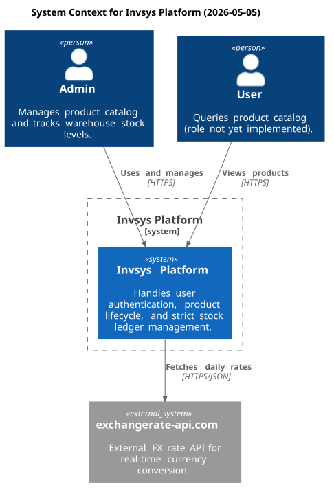
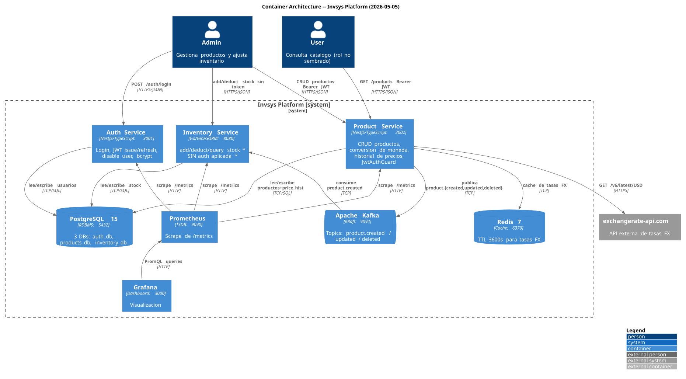
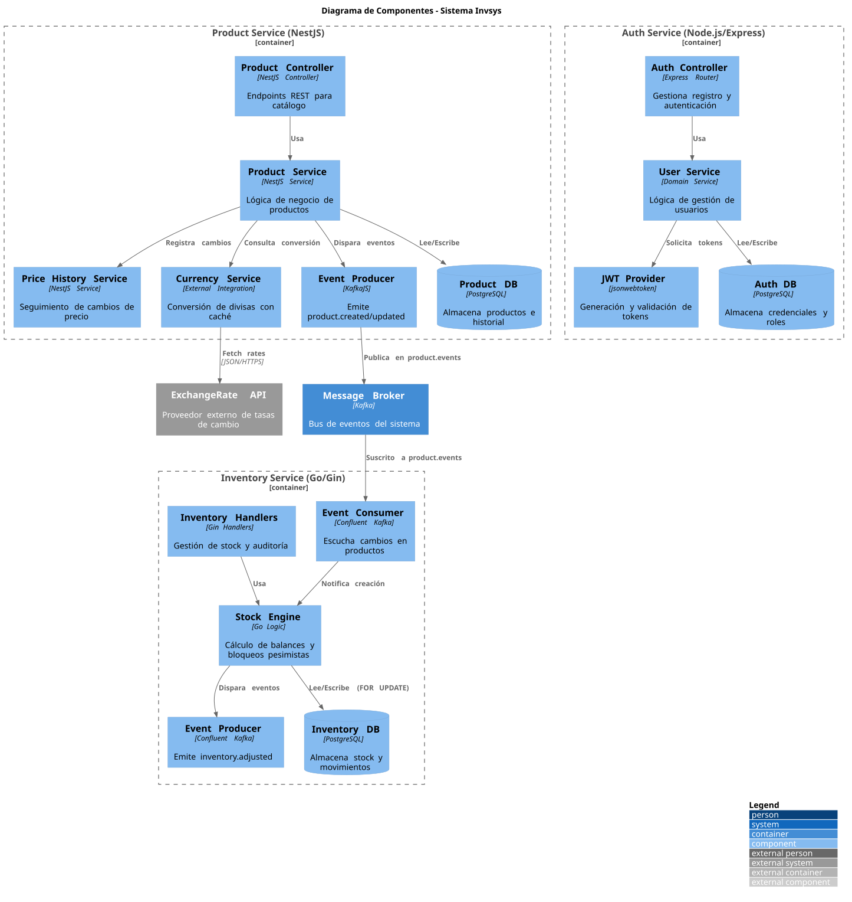
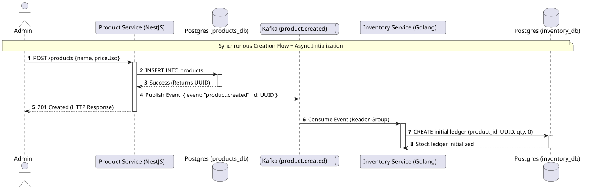
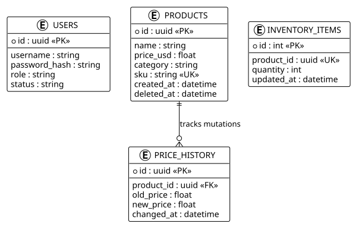

# Invsys: Plataforma Empresarial de Inventarios Basada en Microservicios

Invsys es un ecosistema de microservicios de alto rendimiento diseñado para gestionar catálogos de productos complejos, conversiones de moneda en tiempo real y libros de inventario de alto tráfico. La arquitectura está construida sobre principios de **Diseño Dirigido por el Dominio (DDD)** y comunicación **Basada en Eventos (EDA)**.

---

## 🚀 Navegación Rápida

- [0. Notas del Arquitecto](#0-notas-del-arquitecto)
- [1. Contexto del Proyecto](#1-contexto-del-proyecto)
- [2. Requerimientos Funcionales](#2-requerimientos-funcionales)
- [3. Resumen de la Solución](#3-resumen-de-la-solución)
- [4. Diagramas C4](#4-diagramas-c4)
- [5. 🗄️ Diagrama de Base de Datos](#5-diagrama-de-base-de-datos)
- [6. 📐 Decisiones de Arquitectura (ADRs)](#6-decisiones-de-arquitectura-adrs)
- [7. 🔌 Diseño de APIs](#7-diseño-de-apis)
- [8. Resultados de Pruebas (QA)](#8-resultados-de-pruebas-qa)

---

## 0. Notas del Arquitecto

Este proyecto no es solo un CRUD; es un sistema distribuido diseñado para la resiliencia y la consistencia eventual. 

- **Políglota**: El **Servicio de Productos** (NestJS) prioriza la flexibilidad del esquema y el desarrollo rápido, mientras que el **Servicio de Inventario** (Golang/Gin) está optimizado para la velocidad de procesamiento de transacciones y el manejo concurrente de stock con bloqueos pesimistas.
- **Resiliencia**: Si el servicio de inventario cae, el servicio de productos puede seguir aceptando nuevos SKUs; los eventos se encolan en Kafka y se procesan automáticamente cuando el servicio vuelve a estar en línea.
- **Auditoría Total**: Cada movimiento de stock y cada cambio de precio se registra en libros de historia inmutables, permitiendo una trazabilidad completa para auditorías financieras.

---

## 1. Contexto del Proyecto

Basado en el [PRD.md](docs/PRD.md), el sistema resuelve la necesidad de una empresa de optimizar su gestión de almacén mediante:
- Gestión eficiente de productos (CRUD).
- Control de stock con alta precisión.
- Sincronización desacoplada mediante eventos.
- Conversión multimoneda (USD, EUR, DOP, CNY) integrada.

---

## 2. Requerimientos Funcionales

| ID | Categoría | Descripción del Requerimiento |
| :--- | :--- | :--- |
| **FR-01** | Productos | Crear productos con nombre, descripción, precio, categoría y SKU. |
| **FR-03** | Productos | Filtrado de productos por categoría específica. |
| **FR-07** | Inventario | Ajuste de stock (Entradas/Salidas) con validación de suficiencia. |
| **FR-09** | Inventario | Historial completo de movimientos por producto. |
| **FR-10** | Precios | Conversión de moneda en tiempo real vía API externa. |
| **FR-11** | Precios | Registro histórico de cambios de precios. |
| **FR-13** | Seguridad | Control de Acceso Basado en Roles (RBAC): Admin y User. |

---

## 3. Resumen de la Solución a Alto Nivel

La solución implementa una arquitectura de **Microservicios Desacoplados**:

1.  **Product Service (Node/NestJS)**: Gestiona el catálogo maestro. Emite eventos a Kafka en cada cambio.
2.  **Inventory Service (Go/Gin)**: Escucha eventos de productos para inicializar registros de stock. Gestiona transacciones de inventario con **bloqueos pesimistas** para evitar condiciones de carrera.
3.  **Auth Service (Node/Express)**: Puerta de enlace para identidad y emisión de JWTs.
4.  **Broker (Kafka)**: El corazón de la comunicación asíncrona.
5.  **Caché (Redis)**: Optimiza la consulta de tasas de cambio y listas de productos frecuentes.

---

## 4. Diagramas C4

### Nivel de Contexto del Sistema
Representa cómo los usuarios interactúan con Invsys y sus dependencias externas (API de Divisas).

### Nivel de Contenedores
Muestra los servicios internos, bases de datos y el flujo de eventos a través de Kafka.

### Nivel de Componentes
Detalla la estructura interna de cada microservicio, sus controladores, servicios de dominio y adaptadores de persistencia/eventos.

### Diagrama de Secuencia
Muestra el flujo de comunicación asíncrona entre servicios cuando se crea un producto y se inicializa su stock.

---

## 5. 🗄️ Diagrama de Base de Datos (ERD)

El sistema utiliza **Database-per-Service**. El siguiente diagrama muestra la relación lógica entre el Catálogo, el Stock y los libros de Auditoría (Precios/Movimientos).

---

## 6. 📐 Decisiones de Arquitectura (ADRs)

Hemos documentado las decisiones críticas para mantener la transparencia técnica:

- **[ADR-001: Estructura de Monorepo](docs/adrs/ADR-001.md)**: Justificación del uso de un monorepo para facilitar la gestión de contratos de eventos y despliegue orquestado.
- **[ADR-002: Bloqueos Pesimistas en Inventario](docs/adrs/ADR-002.md)**: Por qué elegimos `FOR UPDATE` en nivel de DB para garantizar la integridad del stock en entornos de alta concurrencia.
- **[ADR-003: Estrategia de Ramas](docs/adrs/ADR-003.md)**: Convenciones de nomenclatura y flujo de trabajo de Git para el equipo.

---

## 7. 🔌 Diseño de APIs

### 🛡️ Auth Service (`:3001/api/v1`)
Responsable de la identidad, emisión de tokens y control de acceso.

| Método | Endpoint | Descripción | Acceso |
| :--- | :--- | :--- | :--- |
| **POST** | `/auth/login` | Autenticación y generación de JWT. | Público |
| **POST** | `/auth/refresh` | Refresca un token existente. | JWT |
| **GET** | `/auth` | Lista todos los usuarios registrados. | Admin |
| **POST** | `/auth/register` | Registra una nueva identidad. | Admin |
| **PATCH** | `/auth/users/:username` | Actualiza password o rol de un usuario. | Admin |
| **POST** | `/auth/disable` | Deshabilita una cuenta de usuario. | Admin |

### 📦 Product Service (`:3002/api/v1`)
Gestión del catálogo maestro y lógica de precios/divisas.

| Método | Endpoint | Descripción | Parámetros |
| :--- | :--- | :--- | :--- |
| **GET** | `/products` | Lista catálogo maestro. | `category`, `currency` |
| **GET** | `/products/:id` | Detalle de producto específico. | `id` (UUID), `currency` |
| **GET** | `/products/:id/history` | Historial cronológico de precios. | `id` (UUID) |
| **POST** | `/products` | Crear nuevo producto (Emite evento). | **Admin** |
| **PUT** | `/products/:id` | Actualización total. | **Admin** |
| **PATCH** | `/products/:id` | Actualización parcial. | **Admin** |
| **DELETE** | `/products/:id` | Borrado lógico (Archivado). | **Admin** |

### 📊 Inventory Service (`:8080/api/v1`)
Motor de stock de alta velocidad y auditoría de movimientos.

| Método | Endpoint | Descripción | Acceso |
| :--- | :--- | :--- | :--- |
| **GET** | `/health` | Estado de salud del servicio y DB. | Público |
| **GET** | `/inventory` | Listado global de stock disponible. | JWT |
| **GET** | `/inventory/:productId` | Stock actual para un SKU. | JWT |
| **GET** | `/inventory/:productId/history` | Auditoría de movimientos (Entradas/Salidas). | JWT |
| **POST** | `/inventory/add` | Incremento de stock (Idempotente). | **Admin** |
| **POST** | `/inventory/deduct` | Egreso de stock (Validación de balance). | **Admin** |
| **DELETE** | `/inventory/:productId` | Archivado de libro de inventario. | **Admin** |

> **Nota sobre Idempotencia**: Los endpoints `POST /inventory/*` requieren el encabezado `Idempotency-Key` para prevenir procesamientos duplicados en casos de reintento de red.

---

## 8. Resultados de Pruebas (QA)

Según el último **[Reporte de Entrega QA](docs/QA-Delivery-Report.md)**, el sistema cumple con el 100% de los criterios de aceptación:

| Dominio | Pruebas Ejecutadas | Aprobadas | Fallidas |
| :--- | :---: | :---: | :---: |
| Autenticación (JWT/RBAC) | 5 | 5 | 0 |
| Ciclo de Vida de Producto | 8 | 8 | 0 |
| Gestión de Inventario | 3 | 3 | 0 |
| Escenarios Complejos (Divisas) | 2 | 2 | 0 |
| **TOTAL** | **18** | **18** | **0** |

**Estado Final: 🟢 PASSED** (100% Cobertura de Requerimientos Funcionales)
