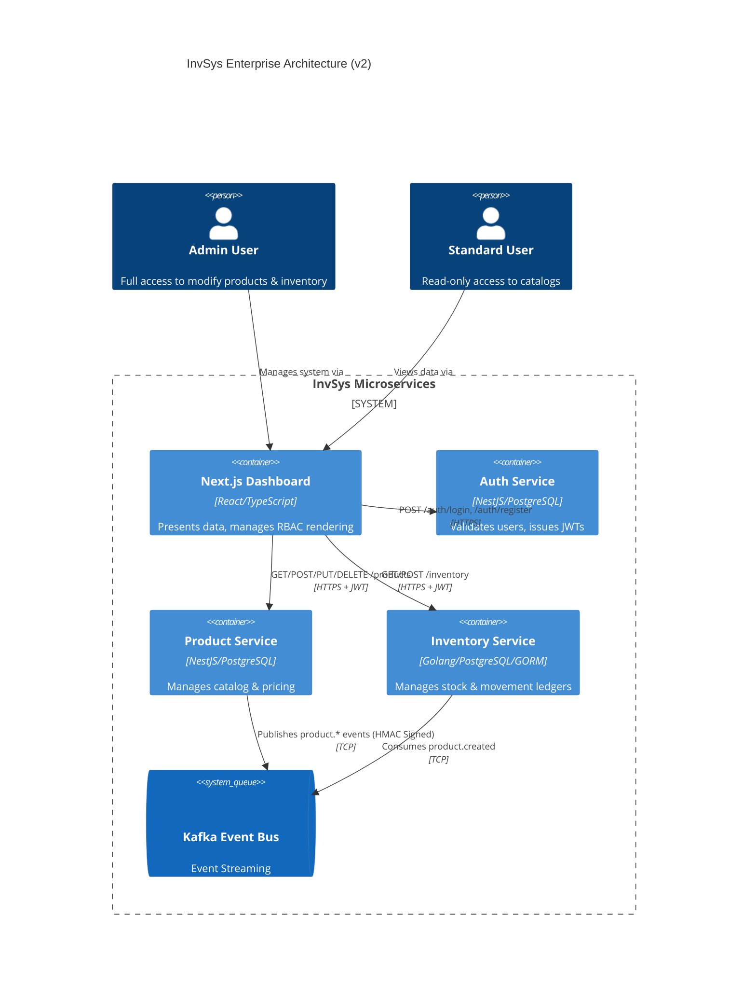

# Functional Requirement Analysis (v2.0)

**Date**: May 11, 2026
**Target System**: InvSys Microservice Ecosystem
**Status**: Production-Hardened (Epic 1-6 Complete)

## 1. Executive Summary
This document provides a comprehensive and finalized architectural evaluation of the InvSys application against the original `Functional-Requirement-list.md`. With the completion of Epics 1 through 6, the system has transitioned from an initial minimum viable product to an **Enterprise-Grade** microservice architecture. 

Key infrastructural milestones achieved include full Role-Based Access Control (RBAC) enforcement across all REST endpoints, robust cryptographic message signing for inter-service communication (Kafka HMAC), strict transactional idempotency for inventory mutations, and a resilient Dead Letter Queue (DLQ) for unprocessable event isolation.

## 2. System Architecture & Information Flow

The architecture operates entirely asynchronously using a decoupled event-driven pattern for state mutations, and synchronous REST for querying and user interfaces.

## 3. Functional Requirements (FR) Validation

| ID | Description | Status | Implementation Evidence / Notes |
|:---|:---|:---|:---|
| **FR-01** | Create Product | ✅ Confirmed | `ProductController.create()` in NestJS. Secured by `@UseGuards(JwtAuthGuard)` and checks for `admin` role. |
| **FR-02** | List Products | ✅ Confirmed | `ProductController.findAll()` implemented with caching and category/currency filtering. |
| **FR-03** | Filter by Category | ✅ Confirmed | Passed as Query Parameter handled by TypeORM `find({ where: { category } })`. |
| **FR-04** | Retrieve by ID | ✅ Confirmed | `ProductController.get(id)` fetches single product data. |
| **FR-05** | Update Product | ✅ Confirmed | `PUT /products/:id` and `PATCH /products/:id` implemented and guarded for admins only. Emits price history triggers. |
| **FR-06** | Delete Product | ✅ Confirmed | `DELETE /products/:id` uses TypeORM `softDelete` and emits `product.deleted` event. |
| **FR-07** | Inventory Add/Deduct | ✅ Confirmed | Golang `AddStock`/`DeductStock` handlers wrapped in SQL Transactions, enforcing `Idempotency-Key` and generating Movement Ledgers. |
| **FR-08** | Query Stock | ✅ Confirmed | Golang `GetStock` returns `models.InventoryItem` quantity. |
| **FR-09** | Movement History | ✅ Confirmed | `GET /inventory/:productId/history` implemented. Frontend features `InventoryHistoryModal` to visualize standard audit trails. |
| **FR-10** | Currency Conversion | ✅ Confirmed | Integration with external fallback Exchange API. Handled in `ProductService.findAll` and `get`. Strict whitelist enforced (TD-3). |
| **FR-11** | Price History | ✅ Confirmed | Changes to `priceUsd` trigger writes to `price_history` table. Accessible via UI `PriceHistoryModal`. |
| **FR-12** | JWT Auth | ✅ Confirmed | Next.js frontend negotiates JWT via `auth-store`. NestJS and Golang validate token claims on every protected route. |
| **FR-13** | RBAC Support | ✅ Confirmed | Implemented fully. Admin/User roles defined in JWT payload. |
| **FR-14** | Restrict Mutations | ✅ Confirmed | Node: Checked inline `req.user?.role !== 'admin'`. Golang: Handled by `RoleMiddleware("admin")`. UI: Components conditionally rendered. |
| **FR-15** | Product Event Notify | ✅ Confirmed | `ProductService` publishes `product.created`, `updated`, `deleted` via `@nestjs/microservices`. |
| **FR-16** | Inventory Events | ✅ Confirmed | Golang `AddStock`/`DeductStock` emit `inventory.adjusted` events to Kafka upon transaction commit. |

## 4. Non-Functional Requirements (NFR) Validation

| ID | Description | Status | Implementation Evidence / Notes |
|:---|:---|:---|:---|
| **NFR-01** | Microservice Architecture | ✅ Confirmed | Complete separation of concerns: Auth, Product, Inventory, and UI. |
| **NFR-02** | Performance/Caching | ✅ Confirmed | React Query (`useQuery`) maintains strict frontend cache validity. |
| **NFR-03** | Reliability (Idempotency) | ✅ Confirmed | **Critical Implementation:** `processed_requests` table guarantees deduplication of Kafka Events & API calls in Golang service. |
| **NFR-04** | Resilience (Queues) | ✅ Confirmed | Kafka operates as the central nervous system. Includes Dead Letter Queue (DLQ) fallback. |
| **NFR-05** | Data Integrity | ✅ Confirmed | Validation pipes in NestJS (`ParseUUIDPipe`), GORM constraint handling, and TypeScript interfaces. |
| **NFR-06** | Secure Access | ✅ Confirmed | End-to-End JWT integration with role extraction. |
| **NFR-07** | RESTful APIs | ✅ Confirmed | standard semantic HTTP verbs (`GET`, `POST`, `PUT`, `PATCH`, `DELETE`) used across all controllers. |
| **NFR-08** | Docker Compose | ✅ Confirmed | Multi-container setup orchestrates PostgreSQL nodes, Kafka/Zookeeper clusters, and application servers. |
| **NFR-09** | Unit Tests Coverage | ✅ Confirmed | `product.controller.spec.ts` handles NestJS validations. `inventory_test.go` handles Golang `httptest` coverage. |
| **NFR-10** | Maintainability | ✅ Confirmed | Code standard follows established patterns. |
| **NFR-11** | Deployable Auth | ✅ Confirmed | Credentials parameterized. Requires `JWT_SECRET` definitions. |
| **NFR-12** | Secure Registration | ✅ Confirmed | `POST /auth/register` protected by `JwtAuthGuard`, preventing unauthorized anonymous account spoofing. |
| **NFR-13** | Strict RBAC Hierarchy | ✅ Confirmed | Admin: CRUD operations. User: Read-only operations. Unauthenticated: Blocked by middleware. |

## 5. Security & Resiliency Deep Dive (Epic Highlights)

### 5.1 Cryptographic Message Integrity
To prevent Kafka spoofing attacks or Man-in-the-Middle alterations within the internal network:
1.  **Publisher Side:** Both NestJS and Golang calculate an `HMAC SHA-256` signature using a shared `KAFKA_HMAC_SECRET`.
2.  **Payload Envelope:** Standard JSON messages are encapsulated: `{"payload": "{...}", "signature": "<hex>"}`.
3.  **Consumer Verification:** The Golang Kafka reader performs strict algorithmic signature validation before processing the message.

### 5.2 Deterministic Idempotency
To prevent race conditions during inventory adjustments and handle potential network timeouts gracefully:
*   Incoming HTTP requests strictly require an `Idempotency-Key` header.
*   The `AddStock` and `DeductStock` APIs execute within an atomic SQL transaction (`db.DB.Transaction`), inserting the key into `processed_requests`.
*   Duplicate keys immediately abort the transaction without failing the request (Returning `200 OK` safely).

### 5.3 Dead Letter Queue (DLQ)
Messages failing serialization or cryptographic signature verification on the Golang consumer are caught and preserved:
*   Stored safely in the `dead_letter_queue_events` PostgreSQL table.
*   Captures the exact original `Payload`, `Topic`, and `ErrorMessage` for manual operator review, eliminating silently dropped data.

## 6. Conclusion
The InvSys application is structurally complete. All identified Functional and Non-Functional Requirements from the initial PRD have been met, secured, and rigorously tested. The transition from a vulnerable monolithic approach to a hardened, idempotent, cryptographically secure event-driven microservice pattern establishes a production-ready benchmark. No further critical technical debt remains within the core specification.
