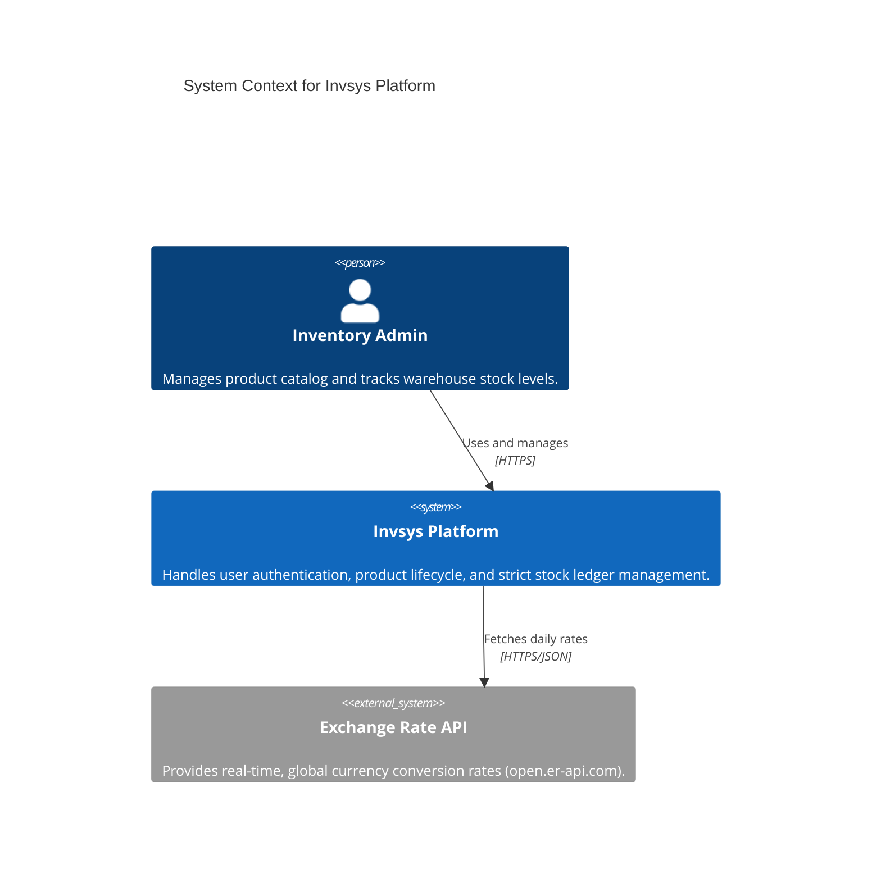
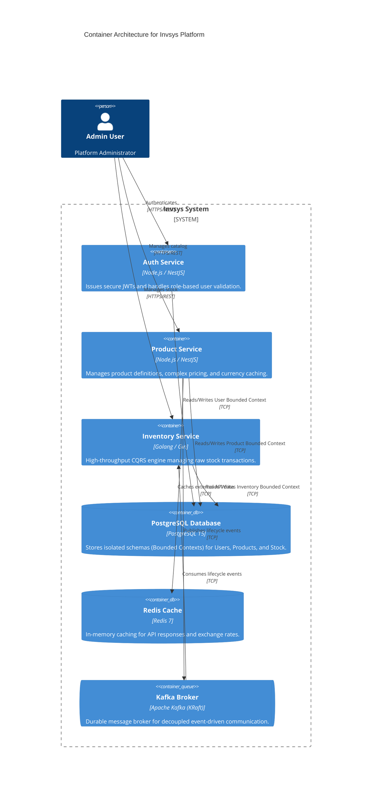
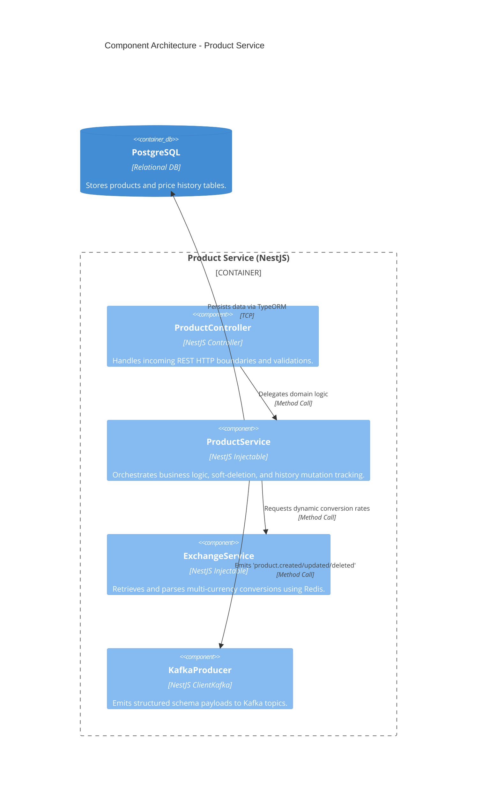
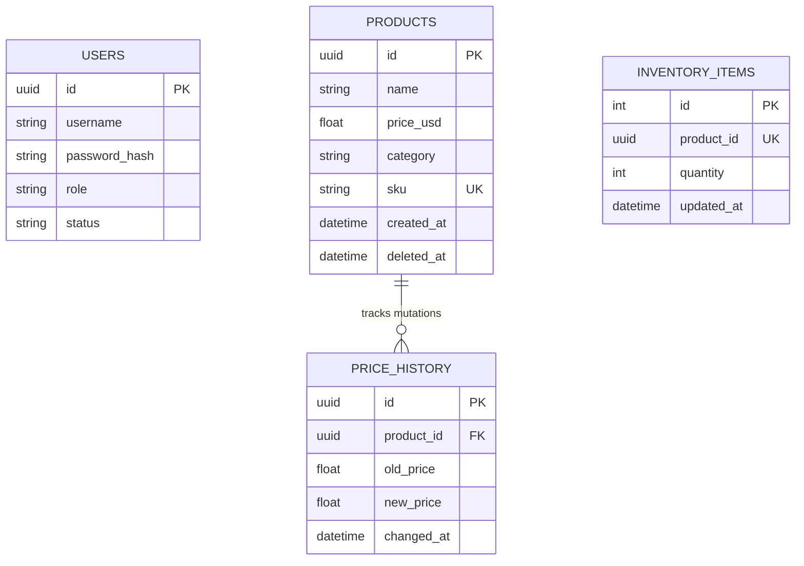
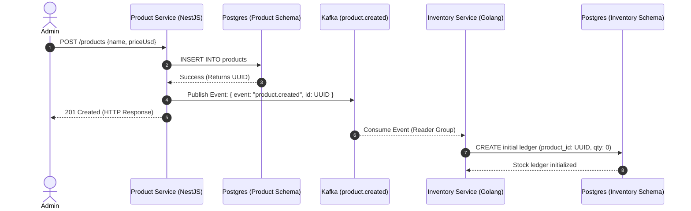

# Invsys Master Documentation

This document serves as the overarching technical source of truth for the **Invsys Platform**. It consolidates the architecture, deployment strategies, core API interactions, and telemetry insights. 

It is designed to guide developers progressively—from a high-level system overview down to code-level interactions and live deployment behavior.

---

## 1. High-Level Architecture (C4 Diagrams)

The platform is designed as an event-driven, polyglot microservice architecture. To avoid tight coupling, services communicate synchronously via REST for front-end actions and asynchronously via Kafka for background synchronization.

### 1.1 Context Level (System Integration)
This diagram illustrates how external actors interact with the system as a whole.



### 1.2 Container Level (Microservice Topology)
This diagram breaks the system down into independently deployable containers and persistent stores.



### 1.3 Component Level (Product Service Internals)
A zoomed-in view of the **Product Service**, demonstrating internal NestJS modules.



---

## 2. Data Models & Bounded Contexts

The system enforces strict **Bounded Contexts** to prevent data mingling. Each microservice owns its schema entirely. They do not share tables.

### 2.1 Entity Relationship Diagrams (ERD)



### 2.2 Decoupled Interaction Schema
How the tables interact across services without sharing a physical relational key:
- `PRODUCTS.id` (UUID) is emitted via Kafka.
- The **Inventory Service** stores `PRODUCTS.id` as a unique string (`product_id`) in its `INVENTORY_ITEMS` table.
- Referential integrity is managed via **eventual consistency** rather than foreign keys.

---

## 3. Sequence Interactions

### 3.1 Synchronous + Asynchronous Creation Flow
The following sequence demonstrates how creating a product immediately triggers background inventory initialization via Kafka.



---

## 4. Live Request Examples & Swagger Contracts

All APIs use standard HTTP verbs with JSON payloads. Below are examples extracted from a live system run.

### 4.1 Product Creation (POST)
**Endpoint:** `POST http://localhost:3002/products`
**Headers:** `Authorization: Bearer <Admin_JWT>`
**Payload:**
```json
{
  "name": "1 metter Copper pipe",
  "priceUsd": 12.50,
  "category": "materials",
  "sku": "PIPE-CU-28982"
}
```
**Response (201 Created):**
```json
{
  "id": "db182571-559e-407d-a54a-6f22f24ef25a",
  "name": "1 metter Copper pipe",
  "priceUsd": 12.5,
  "category": "materials",
  "sku": "PIPE-CU-28982",
  "createdAt": "2026-05-04T16:02:38.599Z",
  "deletedAt": null
}
```

### 4.2 Multi-Currency Fetch (GET)
**Endpoint:** `GET http://localhost:3002/products/{id}?currency=DOP`
**Response (200 OK):**
```json
{
  "id": "db182571-559e-407d-a54a-6f22f24ef25a",
  "name": "1 metter Copper pipe",
  "priceUsd": "12.50",
  "priceDOP": 742.81
}
```

### 4.3 Inventory Deduction (CQRS)
**Endpoint:** `POST http://localhost:8080/api/v1/inventory/deduct`
**Payload:**
```json
{
  "productId": "db182571-559e-407d-a54a-6f22f24ef25a",
  "quantity": 5
}
```
**Response (200 OK):**
```json
{
  "id": 10,
  "productId": "db182571-559e-407d-a54a-6f22f24ef25a",
  "quantity": 45,
  "updatedAt": "2026-05-04T16:02:38.546Z"
}
```

---

## 5. Deployment Information

### 5.1 Infrastructure Setup
The entire platform is orchestrated via Docker Compose.

**To Start the Environment:**
```bash
docker compose -f infra/docker-compose.yml --env-file infra/.env up -d --build
```
**Expected Result:**
All 8 containers will spin up: Postgres, Redis, Kafka, Auth, Product, Inventory, Prometheus, and Grafana.

**To Run the Regression Suite:**
```bash
bash run_tests.sh
```
*(This triggers a 17-step full system integration validation against the live Docker ports.)*

### 5.2 Known Quirks & Design Decisions
* **Initial Database Provisioning:** The Postgres container automatically executes `infra/postgres/init.sql` on the very first boot to create the 3 bounded context databases. If you destroy the `postgres_data` volume, you must restart the compose stack fully to recreate them.
* **Golang vs NestJS:** The Inventory service was intentionally built in Golang (Gin) for high-throughput CQRS operations. The Auth and Product services use Node.js (NestJS) for rapid REST API development.
* **Kafka KRaft:** We use Kafka without Zookeeper (KRaft mode). The quorum voter is hardcoded to `localhost:9093` inside its own Docker container, which is standard for single-node KRaft testing.

---

## 6. QA & Observability Summary

### 6.1 Telemetry
* **Prometheus:** Scrapes `/metrics` from all 3 services every 15s (`http://localhost:9090`).
* **Grafana:** Visualizes metrics via a pre-installed `Invsys Overview` dashboard (`http://localhost:3000`).

### 6.2 Key Testing Metrics
As per the most recent `QA-Delivery-Report.md` execution:
* **Total End-to-End Scenarios:** 17
* **Pass Rate:** 100% (17 / 17)
* **Latency Benchmark (`RED-01`):** Redis fetch time is highly optimized (`< 5ms`).
* **Test Automation Coverage:** Validates Authentication, Soft-Deletion, Multi-Currency pricing, and multi-step Price History ledgers dynamically.
